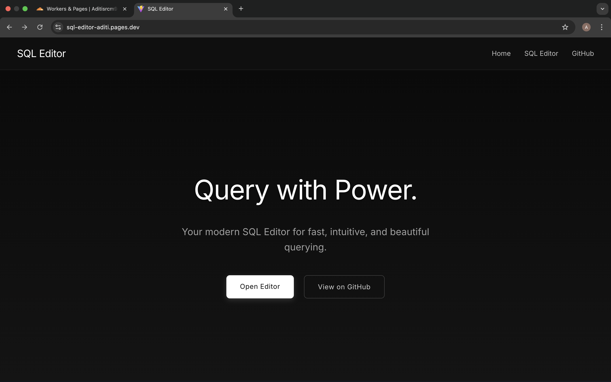
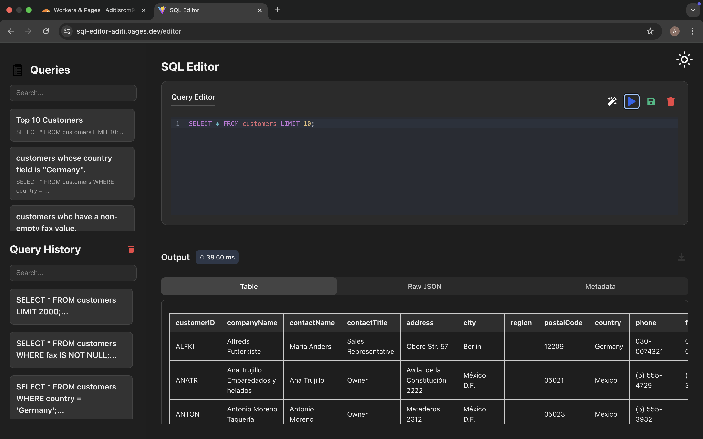
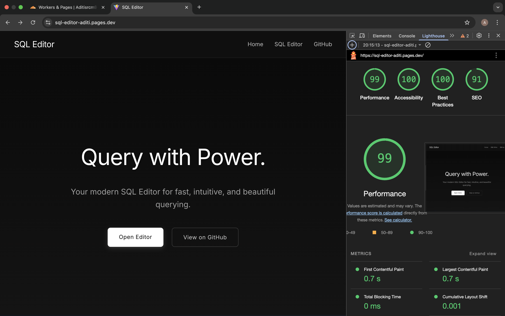
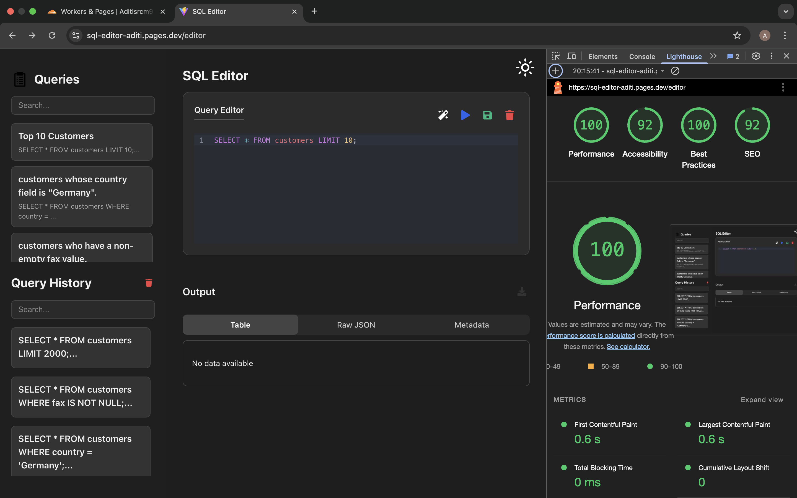

# SQL Editor – Atlan Frontend Task

🔗 **Live Demo:** [https://sql-editor-aditi.pages.dev](https://sql-editor-aditi.pages.dev)

---

## Introduction

This project was developed as a part of the **Atlan Frontend Challenge**. It allows users to run SQL queries on a desktop interface in an intuitive online editor and explore query results across multiple formats.

> **Note**: This is a **frontend-only** application. SQL execution is mocked using predefined queries and local JSON files.

---

## ⚙️ Features

-  Predefined SQL queries with instant load
-  Code editor with syntax highlighting (CodeMirror)
-  Toggleable SQL Copilot assistant (mock)
-  Output tabs: **Table**, **Raw JSON**, and **Metadata**
-  Export results as CSV and JSON
-  Light / Dark mode with toggle and persistence
-  Query history with localStorage caching
-  Responsive and accessible interface

---

##  Data

The dataset used in this app is mock data. Output results for queries are stored as static `.json` files. You can replace them with your own mock data if needed.

---

## Performance & Optimization

Performance was a key goal in this build. All optimizations were benchmarked using:

- **Lighthouse**
- **Google PageSpeed Insights**
- **GTMetrix**

###  Results

| Metric                    | Desktop         | Mobile         |
|--------------------------|-----------------|----------------|
| Time to Interactive      | ~0.5s           | ~1.6s          |
| Largest Contentful Paint | ~820ms          | ~1.4s          |
| Lighthouse Score         | 90+ Performance | 90+ Accessibility |

---

##  Optimization Techniques

1. **Lazy Loading**  
   SQL Copilot is lazy-loaded with `React.lazy` and `Suspense`.

2. **Minimal Dependencies**  
   Only essential libraries like `CodeMirror` and `react-icons` are used.

3. **Responsive Units**  
   Used `em`, `rem`, `vh`, and `vw` for flexible layout scaling.

4. **Dark Mode Support**  
   Theme persists with localStorage and updates via a single state toggle.

5. **Accessibility Improvements**  
   - ARIA labels on interactive elements  
   - Keyboard-accessible scroll regions  
   - Sufficient color contrast for text

6. **Cloudflare Pages Hosting**  
   Leveraged CDN-level caching and edge delivery for improved speed. So yay for extra security

---

## Tech Stack

- **React + Vite** – Modern JS framework and build tool
-  **CodeMirror** – SQL editor integration
-  **Cloudflare Pages** – Deployment platform
-  **Vanilla CSS** – No Tailwind or Bootstrap

---


## Screenshots

### Landing Page


### SQL-Editor


### Page Loadtime



---


---

## Deployment

- Platform: **Cloudflare Pages**
- Branch: `main`
- Build Command: `npm run build`
- Output Directory: `dist`

---

## 💡 Problem Statement Summary


Create a web-based SQL editor interface that:
- Supports writing queries on mock data
- Displays results clearly
- Prioritizes speed, responsiveness, and UX
- Is built using a modern JS framework (React in this case)

---


##  Local Setup

```bash
# Clone the repo
git clone https://github.com/AditiKulkarni9/sql-editor.git
cd atlan-project

# Install dependencies
npm install
#or 
bun install

# Start development server
bun run dev

##  Contact

```
###

**Made with ❤️ by [Aditi]**  
🔗 GitHub: [github.com/AditiKulkarni9](https://github.com/AditiKulkarni9)  
🔗 LinkedIn: [linkedin.com/in/aditi-kulkarni-393568229](https://www.linkedin.com/in/aditi-kulkarni-393568229/)