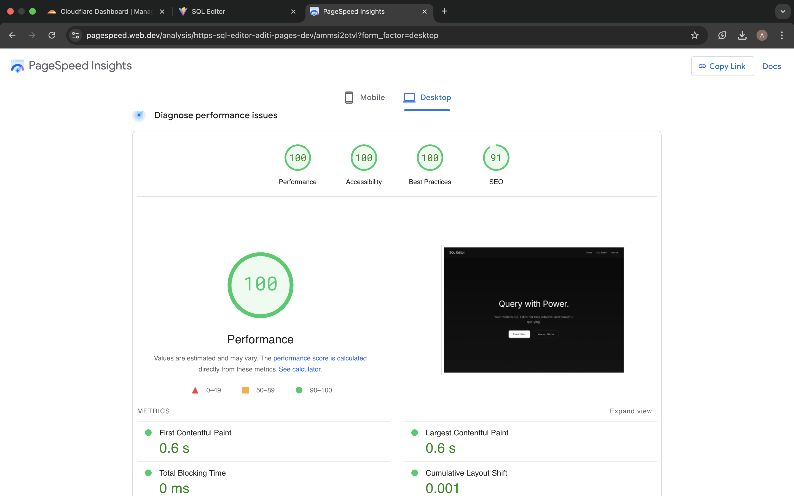
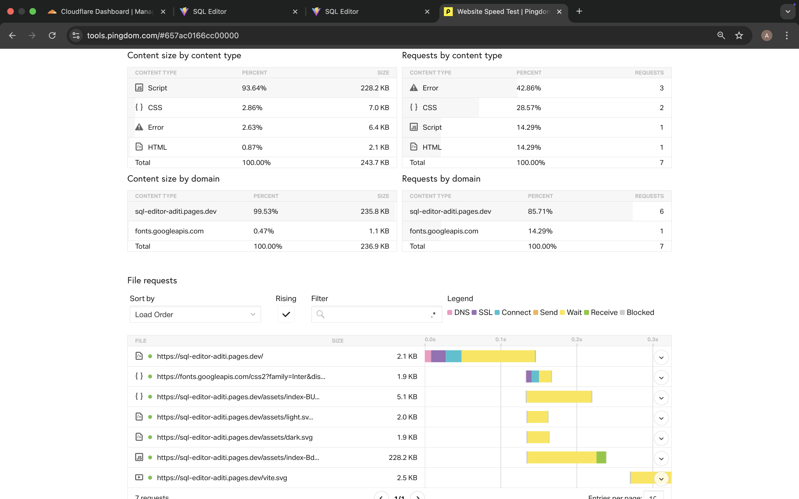

# SQL Editor – Atlan Frontend Task

🔗 **Live Demo:** [https://sql-editor-aditi.pages.dev](https://sql-editor-aditi.pages.dev)

---

## Introduction

This project was developed as a part of the **Atlan Frontend Challenge**. It allows users to run SQL queries on a desktop interface in an intuitive online editor and explore query results across multiple formats.

> **Note**: This is a **frontend-only** application. SQL execution is mocked using predefined queries and local JSON files.

---

## ⚙️ Features

-  Predefined SQL queries with instant load
-  Code editor with syntax highlighting (CodeMirror)
-  Toggleable SQL Copilot assistant (mock)
-  Output tabs: **Table**, **Raw JSON**, and **Metadata**
-  Export results as CSV and JSON
-  Light / Dark mode with toggle and persistence
-  Query history with localStorage caching
-  Responsive and accessible interface
-  Realtime execution time for queries

---

##  Data

The dataset used in this app is mock data. Output results for queries are stored as static `.json` files. You can replace them with your own mock data if needed.

---

## Performance & Optimization

Performance was a key goal in this build. All optimizations were benchmarked using:

- **Lighthouse**
- **Google PageSpeed Insights**
- **GTMetrix**

###  Results

| Metric                    | Desktop         |
|--------------------------|-----------------|
| Time to Interactive      | ~0.5s           |
| Largest Contentful Paint | ~820ms          |
| Lighthouse Score         | 90+ Performance | 

---

##  Optimization Techniques

1. **Lazy Loading**  
   SQL Copilot is lazy-loaded with `React.lazy` and `Suspense`.

2. **Minimal Dependencies**  
   Only essential libraries like `CodeMirror` and `react-icons` are used.

3. **Responsive Units**  
   Used `em`, `rem`, `vh`, and `vw` for flexible layout scaling.

4. **Dark Mode Support**  
   Theme persists with localStorage and updates via a single state toggle.

5. **Accessibility Improvements**  
   - ARIA labels on interactive elements  
   - Keyboard-accessible scroll regions  
   - Sufficient color contrast for text

6. **Cloudflare Pages Hosting**  
   Leveraged CDN-level caching and edge delivery for improved speed resulting in ~0.5s load time in lighthouse desktop. So yay for extra security

7. **Bun**
    faster dependency installation and rebuilds resulting in quicker iteration cycles while building. Bun's dev server helped me avoid node's single threaded performance bottlenecks and bun uses fewer resources due to low level memory management

---

## Tech Stack

- **React + Vite** – Modern JS framework and build tool
-  **CodeMirror** – SQL editor integration
-  **Cloudflare Pages** – Deployment platform

---


## Screenshots

### Landing Page


### SQL-Editor


### Page Loadtime





---


---

## Deployment

- Platform: **Cloudflare Pages**
- Branch: `main`
- Build Command: `npm run build`
- Output Directory: `dist`

---

## 💡 Problem Statement Summary


Create a web-based SQL editor interface that:
- Supports writing queries on mock data
- Displays results clearly
- Prioritizes speed, responsiveness, and UX
- Is built using a modern JS framework (React in this case)

---


##  Local Setup

```bash
# Clone the repo
git clone https://github.com/AditiKulkarni9/sql-editor.git
cd atlan-project

# Install dependencies
npm install
#or 
bun install

# Start development server
bun run dev

```

## Problem Statement

### SQL Editor
Create, design and implement a web-based application capable of running SQL queries and displaying the results of said query. The application must include a space which accepts SQL queries in the form of user inputs, then runs the given query, and displays the result within the application..

You must include a space to accept SQL queries. This can be as simple as a text area or as complex as a full-blown code editor.

<strong>*Note:</strong> Do not worry about the backend of the app. Just focus on the frontend. Use stubs & mocks wherever you think the backend is necessary.

<strong>*Note2:</strong> Do not write SQL logic to show data results. Have a few predefined SQL queries and show their results directly.

<strong>Sample csv data you can use:</strong> https://github.com/graphql-compose/graphql-compose-examples/tree/master/examples/northwind/data/csv

<strong>Things to note:</strong>
1. Use a JavaScript framework for the task, preferably Vue.js/Nuxt.js but any framework would work. <strong>DO NOT code</strong> in vanilla JS.
2. You are <strong>NOT</strong> restricted to use this particular data. You can use any external data as well, if you want.
3. Calculate the page load time of your app. Write the page load time in README. Also write, how did you calculate the page load time of the app.
4. If you made any changes to optimize the page load time of your app, write all the steps you took to optimize the page load time in README.

<strong>Submission details:</strong>
1. Host the code in a version control system eg. Github, Gitlab etc, and send us the link to the repository.
2. Also, host the web app online using services like Netlify, Surge etc and send us its link. (DO NOT EXPECT the person checking the task to install your web app locally. There can be a lot of issues and back & forth, in case of any issue during local installation. It’s better you host the app and send us the link)

<strong>You will be judged on the following: </strong>
1. Code structure and readability.
2. Page layout and feature set
3. Information hierarchy of all the content and components shown on the page(s) of your app.
4. Page load time of your app.

<strong><em>Good luck!</em></strong>

**Made with ❤️ by [Aditi]**  
🔗 GitHub: [github.com/AditiKulkarni9](https://github.com/AditiKulkarni9)  
🔗 LinkedIn: [linkedin.com/in/aditi-kulkarni-393568229](https://www.linkedin.com/in/aditi-kulkarni-393568229/)